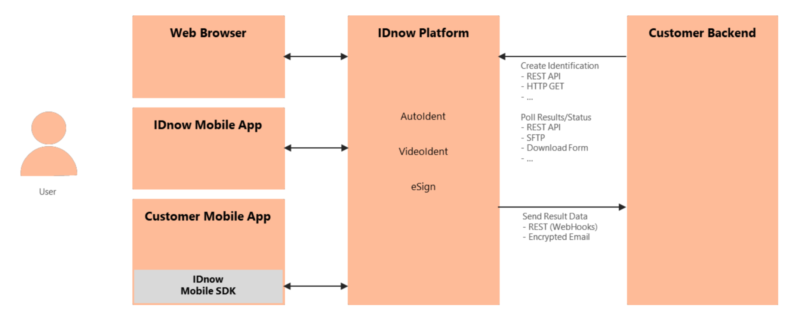
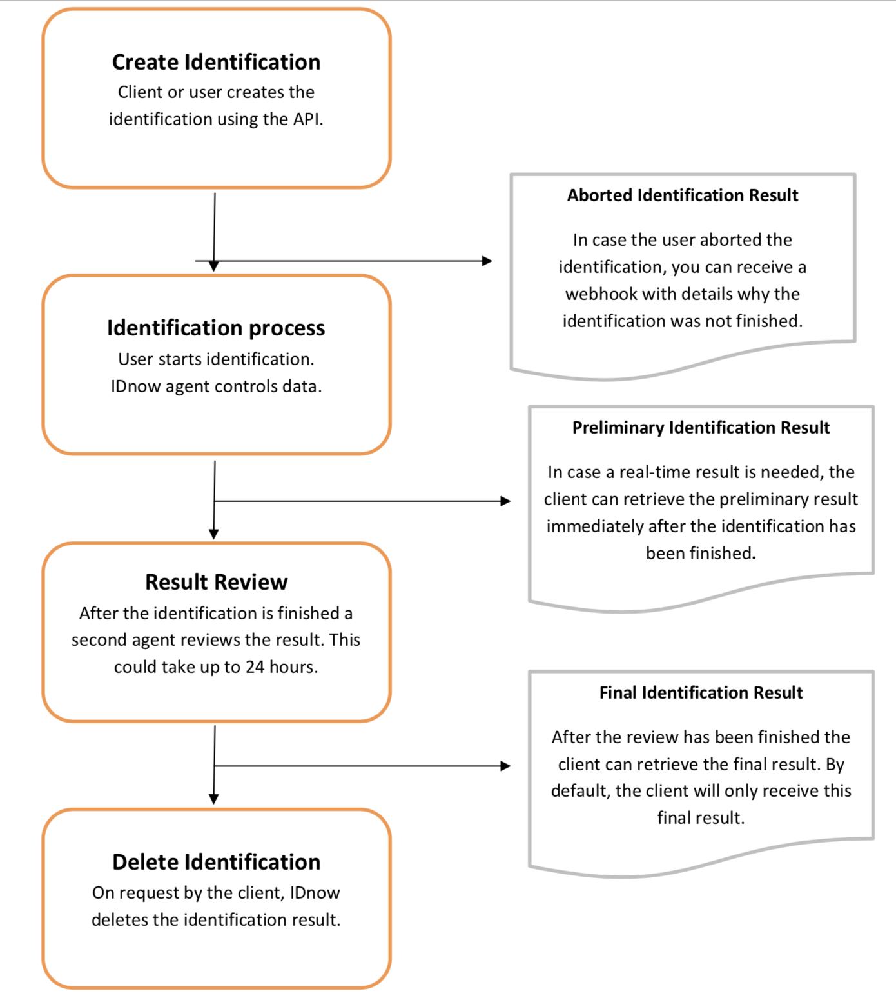

# Overview

The IDnow platform can be used to identify persons and electronically sign contracts. The IDnow
platform supports this functionality with different products:

* IDnow AutoIdent
* IDnow VideoIdent
* IDnow eSign

These products can be used to verify the identity of persons and in the case of IDnow eSign can issue
electronic signatures.

The above products all share the same API as described in the following chapters. The API
documentation doesn’t explicitly refer to products (unless required) but refers to identifications
irrespectively by which product the identity is verified.

During the technical onboarding process IDnow will enable and configure the respective product(s)
agreed upon.

IDnow right now offers two different mobile SDKs (one for AutoIdent and one for VideoIdent and eSign)
which can be used to integrate the IDnow solution into customer specific mobile apps. IDnow also
offers readily available mobile apps via Google Play and Apple App Store which can be used by users
to execute the identification process.



## Products
### IDnow AutoIdent

IDnow AutoIdent offers a fully automated solution to identify a person. The process automatically

* Determines the kind of document used (e.g. passport, ID-card, driver-license)
* Determines the version of the document (e.g. German passport)
* Retrieves the data from the document
* Performs a biometric comparison
* Executes a liveness detection and
* Verifies the genuineness of the document used during the process

Dnow offers mobile Apps for iOS and Android as well as mobile SDKs for integration into customer
specific apps in order to support the AutoIdent process

### IDnow VideoIdent

IDnow VideoIdent allows to verify the identity of a person along with a verification if the document
used is genuine in a process guided by an IDnow Ident Specialist. The user and IDnow Ident Specialist
are interacting with each other during this process using a video-chat.

IDnow offers mobile Apps for iOS and Android for this process. IDnow offers mobile SDKs as well to
integrate IDnow VideoIdent into customer specific mobile apps. IDnow VideoIdent can also be used
with a web browser by the user.

### IDnow eSign

IDnow eSign issues qualified electronic signatures (QES) on one or more PDF documents. The IDnow
eSign product relies on the IDnow VideoIdent technology to verify the identity of the person signing
the PDF documents.

As with IDnow VideoIdent, IDnow eSign is available on mobiles and web browsers.

## Definitions

* <code>Company</code> - Customer of IDnow who requests the identification (a bank for example).
* <code>User</code> - The person who needs to be identified (end consumer).
* <code>Transaction Number</code> - ID used to identify the requested identification. This ID should be used by the company as a key to assign the identification to an internal customer data set. The transaction number shall not be guessable. The IDnow system treats the transaction number as case insensitive.
* <code>Ident-ID</code> - Internal (unique) ID generated by IDnow to identify an identification (e.g. ABC-DEFGH). This ID is also used to start an identification via the mobile apps.

## Subdomains
Data Center | Term | Definition
-------------- | -------------- | --------------
DE | go.idnow.de | Interface/Website the user sees, when identifying for a product of a company
DE | gateway.idnow.de | Interface for companies to send client data to IDnow (before identification) or to retrieve data from IDnow (after identification)
DE | api.test.idnow.de | Interface for companies to test their implementation
CH | go.online-ident.ch | See go.idnow.de
CH | gateway.online-ident.ch | See gateway.idnow.de

## Lifecycle of Identification



### Preliminary vs Final Results

If the company journey depends on the identification result and should continue in real-time it is recommended to use the preliminary results. In other cases, it is recommended to use the final results only.

Company Journey depends on identification result | Company Journey continues in real-time | Recommendation | Example
-------------- | -------------- | -------------- | --------------
Yes | No | Final results only | User opens a bank account. After the identification, the user is asked to send in a paper contract to the bank. The account is opened after the paper contract is received by the bank.   
No | Yes | Final results only | User opens a bank account. After the identification the user can directly log into his account and use basic features. The identification result is double checked by the bank in a manual (non real-time) process to activate/deactivate all features of the account.
Yes | Yes | Preliminary results and final results | User applies for a bank account. After the identification the bank account can directly be used in real-time. In case there are data changes detected during review, the bank account data can be updated automatically.

<aside class="warning">
Note that preliminarily successful identifications can later be canceled in case they do not pass the review. Due to legal requirements, all personal information (incl. images, audio file, etc.) is deleted in such a case. If you decide to keep the customer nonetheless, it is at your own risk. However, you need to make sure that you retrieve the data from the preliminary results before it is deleted. Ideally, after you received the relevant webhook.
</aside>

# Creating Identifications

The REST API lets you pass data about the user to IDnow’s gateway server in order to then start an
identification process.

The general flow is as follows:

* Your application collects the personal information in the normal checkout process.
* Your server creates a unique transaction number (here referred to as <transactionnumber>)
* Your server POSTs the data to IDnow's gateway server
* Your server redirects the client to IDnow's web server or you start the identification using the
SDK (iOS / Android).
* The user is taken to the IDnow System and follows the verification steps.

To create an identification with eSigning, the respective documents need to be uploaded. For details
on eSigning look up chapter Identifications with eSigning.

<aside class="notice">
To ensure that all parameters are encrypted, all requeststo the IDnow live server are always performed
using HTTPS.
</aside>

### Transaction Number

A unique ID generated by your system for each identification with a maximum length of 255 characters.

This number will be provided back to you as your transaction number, so that you can easily make a
connection between your application and the identification. Please ensure that the transaction
number is not guessable.

A typical example is a UUID (version 4) as the value.

Though, to be compatible with the IDnow system, your transaction number may contain only the
following characters: <code>a-zA-Z0-9_-</code>

The transaction number is case insensitive.

Additionally, the IDnow system (internally) assigns each identification another ID which is called IdentID and also visible for the user. It takes the form of "ABC-DEFGH".

## Header

<table>
<thead>
<th>Field</th>
<th>Mandatory</th>
<th>Content</th>
<th>Description</th>
</thead>
<tbody>
<tr>
<td>X-API-KEY</td>
<td>Yes</td>
<td>Your API Key</td>
<td>Causes a 401 unauthorized error if not provided.</td>
</tr>
<tr>
<td>Content-Type</td>
<td>Yes</td>
<td>application/json</td>
<td></td>
</tr>
</tbody>
</table>

## Pre-defining Values for Questions

> To pre-define the answers, set an array with the questions key and the desired value:

```json
{
  "questions": {
    "question_key_str": {
      "value": "value"
    },
    "question_key_int": {
      "value": 1
    },
    "question_key_date": {
      "value": "1975-12-20"
    }
  }
}
```

``` javascript
  alert('Hello World!')
```

``` csharp
  Console.WriteLine("Hello World!");

```

IDnow supports asking additional questions during the identification process. The question is only
shown to the identification agent. Questions can be in the form of radio buttons, dropdowns, input
fields, date fields etc. Additionally, questions can be configured to be read-only or only be shown
depending on the selection from other questions our depending on values from the identification itself
(like country of the user for example).

Using this REST API, values for questions can be pre-defined for the agent. The agent will see the
selected answer and will be able to modify it (unless read-only is enabled).